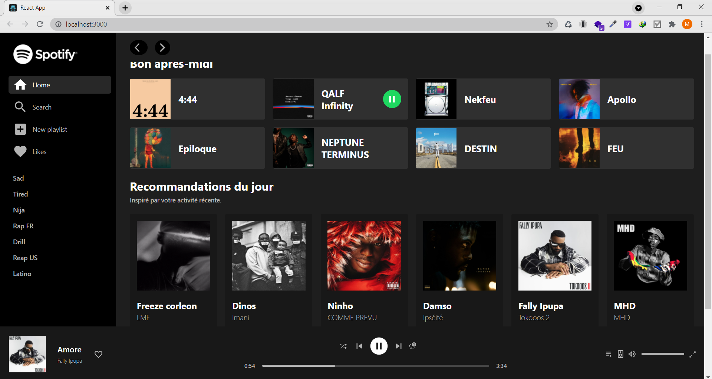

# This Repo contain spotify Clone made with React js

## Installation

- Clone this repo:

```bash
git clone https://github.com/niemet0502/spotify-clone.git
```

- Change directory to the project

```bash
cd spotify-clone
```

- Install dependencies

```bash
npm install or yarn install
```

- launch project`

```bash
npm start
```

- APP

<br>


<a href="https://m-spotify-clone.netlify.app/" target="_blank">Live</a>
